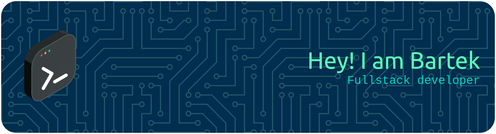

<!-- Banner -->
 

  

<h1 align="center">
  
</h1>

###

<h1 align="left">🧑‍💻 About Me</h1>

###

<h4 align="center">Frontend & backend developer working with React | JavaScript | HTML | CSS | PHP | Express.js  Anime enjoyer 🎌 | Gamer 🎮 | Tech enthusiast ⚙️ | Dark Fantasy Lover 🏰</h4>

###

<h1 align="left">🛠️ Tech Stack</h1>

###

 

  
  
  
  
  
  
  
  
  
  
  
  
  
  
  
  
  
  
  
  
  
  
  
  
  
  
  
  
  
  
  
  
  
  
  

###

  

###

<picture>
  <source media="(prefers-color-scheme: dark)" srcset="https://raw.githubusercontent.com/SouthKioto/SouthKioto/output/pacman-contribution-graph-dark.svg">
  <source media="(prefers-color-scheme: light)" srcset="https://raw.githubusercontent.com/SouthKioto/SouthKioto/output/pacman-contribution-graph.svg">
  
</picture>

###

  
  

###

<h3 align="center">✨ Thanks for visiting my profile! ✨</h3>

###

 

  

###
